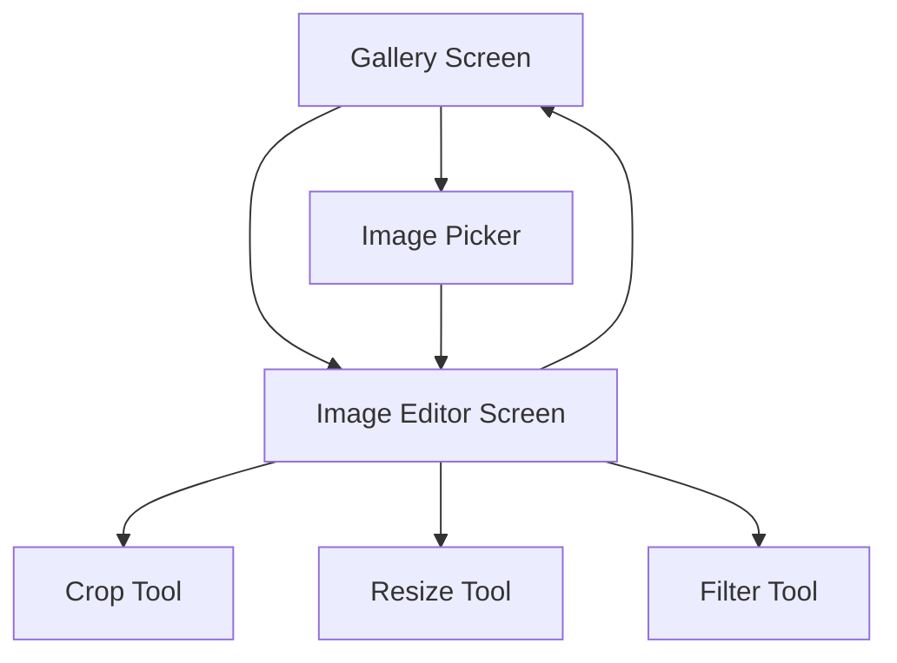
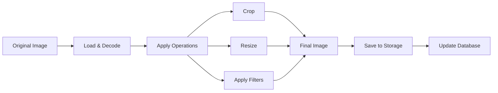

# Design Document

## Overview

The Image Editor App is an Android application built with Jetpack Compose that allows users to crop, resize, and apply filters to images. The app follows clean architecture principles with clear separation of concerns across presentation, domain, and data layers. All edited images are persisted locally with metadata stored in a Room database.

### Key Technologies
- **UI Framework**: Jetpack Compose with Material 3
- **Architecture**: Clean Architecture (Presentation, Domain, Data layers)
- **Dependency Injection**: Hilt
- **Database**: Room with SQLite
- **Image Processing**: Android Graphics APIs with custom filters
- **State Management**: ViewModel + StateFlow
- **Image Loading**: Coil for efficient image loading and caching
- **File Storage**: Internal app storage for edited images

## Architecture

### Layer Structure

```
┌─────────────────────────────────────────┐
│           Presentation Layer            │
│  ┌─────────────┐ ┌─────────────────────┐│
│  │  Composables│ │    ViewModels       ││
│  │             │ │   (StateFlow)       ││
│  └─────────────┘ └─────────────────────┘│
└─────────────────────────────────────────┘
                    │
┌─────────────────────────────────────────┐
│            Domain Layer                 │
│  ┌─────────────┐ ┌─────────────────────┐│
│  │  Use Cases  │ │   Domain Models     ││
│  │             │ │                     ││
│  └─────────────┘ └─────────────────────┘│
└─────────────────────────────────────────┘
                    │
┌─────────────────────────────────────────┐
│             Data Layer                  │
│  ┌─────────────┐ ┌─────────────────────┐│
│  │ Repositories│ │  Data Sources       ││
│  │             │ │ (Room DB, FileSystem)││
│  └─────────────┘ └─────────────────────┘│
└─────────────────────────────────────────┘
```

### Navigation Structure



## Components and Interfaces

### Presentation Layer

#### Screens
1. **GalleryScreen**: Displays grid of saved edited images
2. **ImageEditorScreen**: Main editing interface with tools
3. **ImagePickerScreen**: System image selection interface

#### ViewModels
1. **GalleryViewModel**
   - Manages gallery state and image list
   - Handles image deletion and sharing
   - Uses `GetSavedImagesUseCase` and `DeleteImageUseCase`

2. **ImageEditorViewModel**
   - Manages current editing session state
   - Handles tool selection and image transformations
   - Uses `SaveImageUseCase`, `ApplyFilterUseCase`, `CropImageUseCase`, `ResizeImageUseCase`

#### UI State Classes
```kotlin
data class GalleryUiState(
    val images: List<SavedImage> = emptyList(),
    val isLoading: Boolean = false,
    val error: String? = null
)

data class ImageEditorUiState(
    val originalImage: Bitmap? = null,
    val editedImage: Bitmap? = null,
    val selectedTool: EditingTool = EditingTool.None,
    val isProcessing: Boolean = false,
    val cropBounds: Rect? = null,
    val availableFilters: List<Filter> = emptyList(),
    val appliedFilters: List<AppliedFilter> = emptyList(),
    val error: String? = null
)
```

### Domain Layer

#### Use Cases
1. **GetSavedImagesUseCase**: Retrieves all saved images from repository
2. **SaveImageUseCase**: Saves edited image with metadata
3. **DeleteImageUseCase**: Removes image from storage and database
4. **ApplyFilterUseCase**: Applies image filters
5. **CropImageUseCase**: Crops image to specified bounds
6. **ResizeImageUseCase**: Resizes image to new dimensions
7. **LoadImageUseCase**: Loads image from URI or file path

#### Domain Models
```kotlin
data class SavedImage(
    val id: String,
    val fileName: String,
    val filePath: String,
    val originalFileName: String?,
    val width: Int,
    val height: Int,
    val fileSize: Long,
    val createdAt: Long,
    val modifiedAt: Long,
    val appliedOperations: List<ImageOperation>
)

sealed class ImageOperation {
    data class Crop(val bounds: Rect) : ImageOperation()
    data class Resize(val width: Int, val height: Int) : ImageOperation()
    data class Filter(val type: FilterType, val intensity: Float) : ImageOperation()
}

enum class FilterType {
    BRIGHTNESS, CONTRAST, SATURATION, BLUR, SHARPEN, SEPIA, GRAYSCALE
}

enum class EditingTool {
    None, Crop, Resize, Filter
}
```

#### Repository Interfaces
```kotlin
interface ImageRepository {
    suspend fun getSavedImages(): Flow<List<SavedImage>>
    suspend fun saveImage(image: Bitmap, metadata: ImageMetadata): Result<SavedImage>
    suspend fun deleteImage(imageId: String): Result<Unit>
    suspend fun getImageFile(imagePath: String): Result<File>
}

interface ImageProcessingRepository {
    suspend fun cropImage(bitmap: Bitmap, bounds: Rect): Result<Bitmap>
    suspend fun resizeImage(bitmap: Bitmap, width: Int, height: Int): Result<Bitmap>
    suspend fun applyFilter(bitmap: Bitmap, filter: FilterType, intensity: Float): Result<Bitmap>
}
```

### Data Layer

#### Room Database
```kotlin
@Entity(tableName = "saved_images")
data class SavedImageEntity(
    @PrimaryKey val id: String,
    val fileName: String,
    val filePath: String,
    val originalFileName: String?,
    val width: Int,
    val height: Int,
    val fileSize: Long,
    val createdAt: Long,
    val modifiedAt: Long,
    val appliedOperationsJson: String // Serialized list of operations
)

@Dao
interface SavedImageDao {
    @Query("SELECT * FROM saved_images ORDER BY modifiedAt DESC")
    fun getAllImages(): Flow<List<SavedImageEntity>>
    
    @Insert
    suspend fun insertImage(image: SavedImageEntity)
    
    @Delete
    suspend fun deleteImage(image: SavedImageEntity)
    
    @Query("DELETE FROM saved_images WHERE id = :imageId")
    suspend fun deleteImageById(imageId: String)
}
```

#### File Management
- **Storage Location**: `{Internal Storage}/Android/data/{package}/files/edited_images/`
- **File Naming**: `edited_image_{timestamp}_{uuid}.jpg`
- **Backup Strategy**: Images stored in app-specific directory (automatically backed up)

## Data Models

### Image Processing Pipeline


### Filter Implementation
Each filter will be implemented as a separate class implementing a common interface:

```kotlin
interface ImageFilter {
    suspend fun apply(bitmap: Bitmap, intensity: Float): Bitmap
}

class BrightnessFilter : ImageFilter {
    override suspend fun apply(bitmap: Bitmap, intensity: Float): Bitmap {
        // ColorMatrix implementation for brightness adjustment
    }
}
```

### Memory Management Strategy
- Use `BitmapFactory.Options` with `inSampleSize` for large images
- Implement image caching with LRU cache
- Process images on background threads
- Use `Bitmap.recycle()` for unused bitmaps
- Implement progressive loading for large images

## Error Handling

### Error Types and Handling Strategy

1. **Image Loading Errors**
   - Corrupted files: Show error message, allow user to select different image
   - Unsupported formats: Display supported format list
   - Memory errors: Automatically reduce image size and retry

2. **Processing Errors**
   - Out of memory: Reduce image quality and retry operation
   - Invalid parameters: Validate inputs before processing
   - Processing timeout: Show progress indicator, allow cancellation

3. **Storage Errors**
   - Insufficient space: Show storage warning, suggest cleanup
   - Permission denied: Request necessary permissions
   - File system errors: Retry with exponential backoff

4. **Database Errors**
   - Corruption: Attempt recovery, reinitialize if necessary
   - Migration failures: Provide fallback migration strategy
   - Constraint violations: Log error, continue with valid data

### Error Recovery Mechanisms
```kotlin
sealed class ImageEditorError {
    object InsufficientMemory : ImageEditorError()
    object StoragePermissionDenied : ImageEditorError()
    object UnsupportedImageFormat : ImageEditorError()
    data class ProcessingFailed(val operation: String) : ImageEditorError()
    data class DatabaseError(val message: String) : ImageEditorError()
}
```

## Testing Strategy

### Unit Testing
- **ViewModels**: Test state management and business logic
- **Use Cases**: Test individual operations and error handling
- **Repositories**: Test data access and transformation logic
- **Image Processing**: Test filter algorithms and transformations

### Integration Testing
- **Database Operations**: Test Room database interactions
- **File Operations**: Test image saving and loading
- **End-to-End Workflows**: Test complete editing sessions

### UI Testing
- **Compose Testing**: Test UI components and interactions
- **Screenshot Testing**: Verify visual consistency
- **Accessibility Testing**: Ensure proper content descriptions and navigation

### Performance Testing
- **Memory Usage**: Monitor bitmap memory consumption
- **Processing Time**: Measure filter and transformation performance
- **UI Responsiveness**: Ensure smooth animations and interactions

## Security Considerations

### Data Privacy
- Images stored in app-specific directory (not accessible to other apps)
- No network transmission of user images
- Metadata stored locally only

### File System Security
- Validate file paths to prevent directory traversal
- Check file extensions and MIME types
- Implement proper file permissions

### Memory Security
- Clear sensitive bitmap data when no longer needed
- Avoid storing images in logs or crash reports
- Use secure deletion for temporary files

## Performance Optimizations

### Image Loading
- Use Coil for efficient image loading with memory and disk caching
- Implement progressive JPEG loading for large images
- Use appropriate image formats (WebP for smaller file sizes)

### Processing Optimizations
- Utilize GPU acceleration where available (RenderScript alternatives)
- Implement multi-threading for CPU-intensive operations
- Use native code (JNI) for performance-critical filters

### UI Performance
- Lazy loading for gallery grid
- Image thumbnails for gallery view
- Debounced filter preview updates
- Efficient recomposition in Compose

### Memory Management
- Implement proper bitmap recycling
- Use memory-mapped files for large images
- Monitor memory usage and implement cleanup strategies
- Use appropriate bitmap configurations (RGB_565 vs ARGB_8888)